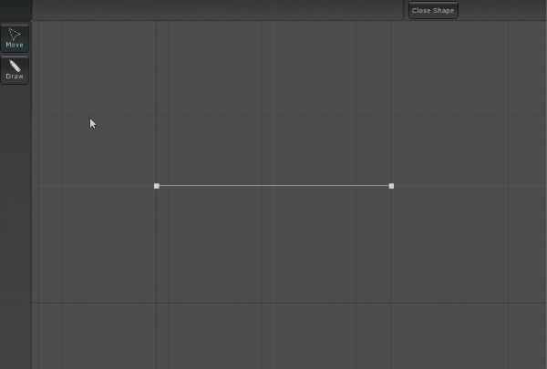
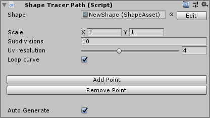
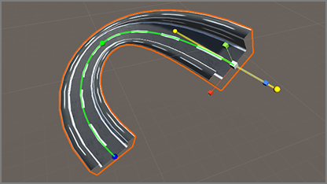
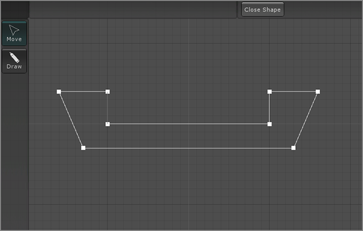
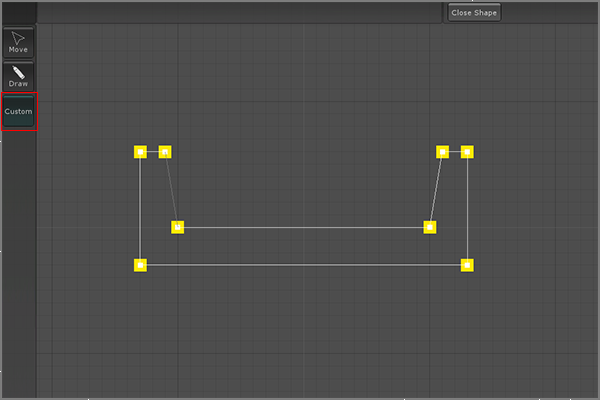

# Shape Tracer

### Shape tracer allow you to extrude shape along a path. You simply have to create your shape on the Shape Editor, setup your path and choose the shape you want to extrude !

&nbsp;



&nbsp;


&nbsp;

## Shape Tracer Path component

 


The `Shape Tracer Path` take a `Shape Asset` as input and extrude it on a bezier curve.</br>If the input `Shape Asset` is empty, you can create a new one with the `Create` button. Also you can edit the current shape with the button `Edit`

You can create a new `Shape Tracer Path` from GameObject/3D Objects/Shape Tracer Path

You can edit the curve with transformation tools:
<li><b>Move Tool</b> : Move selected point or selected tangent, hold <b>Alt</b> to disable tangent mirror editing</li>
<li><b>Rotate Tool</b> : Pitch the selected point</li>
<li><b>Scale Tool</b> : Set X and Y scale of the point</li> 
Press <b>Escape</b> to deselect point

&nbsp;


`Shape Tracer Path` Settings:
<li><b>Shape</b> : The current shape asset used by the path</li>
<li><b>Scale</b> : The global scale of each point</li>
<li><b>Subdivisions</b> : The subdivisions number per points</li>
<li><b>UV resolution</b> : The UV tiling on V</li>
<li><b>Loop Curve</b> : Select true to make loop the curve</li>

&nbsp;


&nbsp;

## Shape Asset

Shape are the cross sections extruded by the shape tracer path. Can be edited from the <b>Shape Editor Window</b>.



You can create a `Shape Asset` from Create/Shape Tracer/Shape or from a `Shape Tracer Path` with a empty shape.</br>
On the asset, select <b>Open Shape Editor</b> to open the Shape Editor Window and edit the shape. Also you can select <b>Edit</b> on a `Shape Tracer Path`.</br>
Toggle <b>Close Shape</b> to make loo your shape. 

By default, you have two tools:
<li><b>Move</b> : Move the select point, hold <b>Ctrl</b> to snap to the grid.</li>
<li><b>Draw</b> : Draw points depending order : hold <b>Ctrl</b> to snap to the grid. <b>The generated mesh normal depends on the point order !</b>.</li>

Press <b>F</b> to center view and <b>Escape</b> to deselect current tool (reset on <b>Move</b> tool by default)


&nbsp;

### Custom Shape Editor Window Tools

You also can create your own shape tools inheriting <b>Shape Tool</b> class. <b>Must be in the Editor assembly of the plugin !</b></br>
Use <b>Shape Tool Attribute</b> to modify the tool icon (Name, Icon Path, Tooltip, Order).

```cs
using UnityEditor;
using UnityEngine;

namespace SorangonToolset.ShapeTracer.Shapes.Tools {
    [ShapeTool("Custom", "A custom tool", 50)]
    public class CustomTool : ShapeEditorTool {
        public override void Process() {
            Handles.BeginGUI();
            Handles.color = Color.yellow;
            for(int i = 0; i < Editor.Asset.shape.PointCount; i++) {
                
                //Get the shape point position
                Vector2 pointPos = Editor.Asset.shape.GetVerticePosition(i);
                
                //Point local space to window space
                pointPos = Editor.PointSpaceToWindowSpace(pointPos);

                Handles.DotHandleCap(0, pointPos, Quaternion.identity, 10f, EventType.Repaint);
            }
            Handles.EndGUI();
        }
    }
}
```

